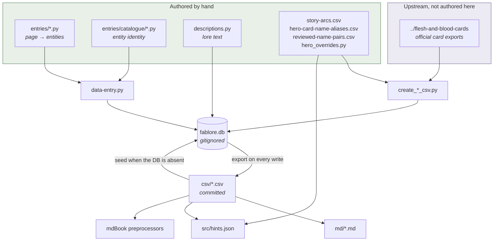
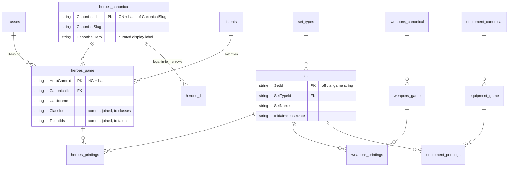

<a name="readme-top"></a>

# Data

This folder contains the data of the characters and locations of Rathe.

This README documents how to run generators and the `db` package, and includes the full CSV schema map under [Data schemas and CSV map](#data-schemas-and-csv-map). Markdown lore under `src/` is not tabular data. Automated pytest lives in the repository root [`tests/`](../../tests/) (run from the repo root after [`requirements-dev.txt`](../../requirements-dev.txt), which includes [`requirements-data.txt`](../../requirements-data.txt) for `create_md.py` and the pre-commit markdown sync hook).

<a name="who-owns-what"></a>

## Who owns what — read this first

The same entity appears in four places: a Python constant, a database row, a CSV row and a Markdown table row. Only **one** of those is something you edit. Everything else is derived from it, and hand-editing a derived file means your change is silently overwritten the next time a script runs.

### The eight files you edit

| File | You are declaring | Applied by |
|---|---|---|
| `entries/<type>.py` | which page links to which entities | `python3 src/data/data-entry.py` |
| `entries/catalogue/*.py` | **what each entity is** — its name, and the fields that form its identity | same |
| `descriptions.py` | the lore text shown in tooltips (`notes` / `description`) | `python3 src/data/descriptions.py` |
| `csv/story-arcs.csv` | arc folder → set mapping | read directly by the preprocessors |
| `csv/hero-card-name-aliases.csv` | printed card name → canonical hero slug, where they differ | `create_heroes_csv.py` |
| `csv/reviewed-name-pairs.csv` | which flagged near-duplicate names you have judged distinct | `validate_data.py` |
| `hero_overrides.py` | curated hero display data the card export cannot supply | `create_heroes_csv.py` |
| `md/character-groups.md`, `data.md` | free-form editorial notes, no CSV source | nothing — read as-is |

Outside this folder, `src/hints_supplement.json` is also hand-written.

### Everything else is derived

`fablore.db`, every other file in `csv/`, every other file in `md/`, and `src/hints.json` are **outputs**. The CSVs carry an `# AUTO-GENERATED FILE` banner; the database is gitignored entirely. Do not edit them in a text editor.

The CSVs are committed and are the source of truth *for seeding a fresh database* — but they are written by the database, not read by the tooling that changes lore. That distinction is the one people get wrong: a CSV row is a **serialisation of a past write**, not an input to the next one.

### Data flow



The loop between `fablore.db` and `csv/` is deliberate and is why the database is disposable: the DB exports after every write, and reseeds from the CSVs when it does not exist. Delete `fablore.db` at any time to get back to exactly what is committed.

### Why an entity is in both the catalogue and a CSV

They serve opposite directions:

- `csv/locations.csv` records the rows that **exist now**.
- `entries/catalogue/locations.py` is what the next `data-entry.py` run will **write**.

They are kept in step deliberately — the catalogue holds a constant for every registry row a story links — but if they ever disagree, **the catalogue wins on the next run**, and if the disagreement is in an identity field it produces a *second row* rather than editing the first. This is why the catalogue exists at all; see [Entity identity](#entity-identity) below.

**Directory layout:**

```
src/data/
  entries/         # AUTHORED — story declarations, one module per story type
    catalogue/     # AUTHORED — one constant per entity; the definition of identity
    _runner.py     # the filtering `db` proxy that data-entry.py drives
  descriptions.py  # AUTHORED — the only writer of notes/description columns
  csv/             # committed pipe-delimited tables; generated except for the three named above
  md/              # mirror tables generated by create_md.py (character-groups.md excepted)
  db/              # SQLite layer: _schema.py, _queries.py, _seed.py, _export.py, _domain.py
  create_*.py      # generator scripts (game data from the sibling card repo)
  mdbook_*.py      # mdBook preprocessors — stdlib only, so a build needs no installs
  *.py             # helpers: pipe_csv_io.py, tab_csv_io.py, registry_ids.py, text_utils.py, …
  fablore.db       # runtime SQLite database — gitignored, seeded from csv/ on first use
```

<p align="right">
(<a href="#readme-top">back to top</a>)
</p>

## Stories and junctions (Database API)

Use the `Database` class from `src/data/db/` to register a markdown file and link entities to it. The DB is seeded from committed CSVs on first open and never committed itself (`fablore.db` is gitignored). After every write the DB exports back to `csv/` so git history and mdBook preprocessors are unaffected.

```python
from pathlib import Path
import sys
sys.path.insert(0, "src/data")
from db import Database, NPCEntry, LocationEntry, NarratedVideoEntry

db = Database("src/data/fablore.db")
db.upsert_story(
    "src/main-story/omens-of-the-third-age/omens-in-the-sky.md",
    story_type="main-story",
    title="Omens in the Sky",
    heroes=["boltyn"],
    npcs=[NPCEntry("Captain Example", species="Human", status="Alive")],
    locations=[LocationEntry("The Grand Bazaar", region="Aria", lore_fragment="grand-bazaar")],
    narrated_videos=[NarratedVideoEntry(author="LSS", source_link="https://…")],
)
```

**`StoryKey` vs `StoryId`:** `StoryKey` is the repo-relative path to the Markdown file (handy for links and humans). `StoryId` is the stable primary key (`ST` + hash of the path). Every `story-*.csv` edge uses `StoryId` only.

**The snippet above is the ad-hoc form, and it is not how you register a story.** Constructing an entry dataclass is fine in a throwaway script, but in a declaration it is the bug described under [Entity identity](#entity-identity): a second literal for one entity creates a second row. Registrations that are meant to stick are declarations in `src/data/entries/`, one module per story type, and they **reference** the catalogue rather than constructing anything:

```python
db.upsert_story(
    path="src/main-story/omens-of-the-third-age/omens-in-the-sky.md",
    story_type="main-story",
    title="Omens in the Sky",
    heroes=["boltyn"],              # canonical slug — raises on an unknown one
    npcs=[npc.CAPTAIN_EXAMPLE],     # defined once in entries/catalogue/npcs.py
    locations=[loc.THE_GRAND_BAZAAR],
    regions=[reg.ARIA],
    dry_run=True,
)
```

The aliases are `npc`, `loc`, `reg`, `mon`, `fauna`, `flora` and `food`, imported at the top of every section module. `NarratedVideoEntry` is the one class still written inline — it has no registry table and no id, so it is per-declaration data with nothing to share.

Run them with:

```bash
python3 src/data/data-entry.py --only src/main-story/omens-of-the-third-age/omens-in-the-sky.md
python3 src/data/data-entry.py                    # every declaration; unchanged ones stay silent
```

Each declaration carries its own `dry_run=` flag: leave it `True` to preview, set it to `False` and re-run to commit, then set it back. Keeping the declarations means the diff of one is the reviewable record of what a page links to, and re-running is a no-op for anything already applied.

`tests/test_data_entry.py` holds the package's invariants: one declaration per story, every declared path still on disk and in `stories.csv`, each declaration in the module its path implies, **no section module constructing an entry class**, and no two catalogue constants hashing to the same id.

### Entity linking semantics

| Entity | In a declaration | Identifier |
|--------|------------------|------------|
| `heroes` | `list[str]` of canonical slugs | looked up in `heroes_canonical`; raises `ValueError` with hint to call `db.print_heroes()` if not found |
| `npcs` | `[npc.NAME]` from `catalogue/npcs.py` | `LC` + hash of the name |
| `regions` | `[reg.NAME]` from `catalogue/regions.py` | `RG` + hash of the name |
| `locations` | `[loc.NAME]` from `catalogue/locations.py` | `LO` + hash of **name and region**; `lore_fragment` (if set) validated against the world lore `.md` file |
| `monsters` / `fauna` / `flora` | `[mon.NAME]` / `[fauna.NAME]` / `[flora.NAME]` | `MO` / `FA` / `FR` + hash of the name |
| `food_drink` | `[food.NAME]` from `catalogue/food_drink.py` | `FD` + hash of **name and kind** |
| `weapons` / `equipment` | `list[str]` of canonical slugs | looked up in canonical tables; raises `ValueError` with hint to call `db.print_weapons()` / `db.print_equipment()` |
| `narrated_videos` | `list[NarratedVideoEntry]`, written inline | no id — rows belong to the one story |

The `Database` API itself still takes the dataclasses (`NPCEntry`, `LocationEntry`, …) and always will; the catalogue is a convention enforced on the declarations, not a change to the API. A new entity means adding one constant to the matching `catalogue/` module — check first that it is not already there under a near-matching name.

Entity link arguments use replace semantics: `None` (default) = leave existing links unchanged; `[]` = clear all links of that type; `[...]` = replace with exactly this list.

### Discovery helpers

```python
db.print_heroes()     # prints slug → display name for all canonical heroes
db.print_weapons()
db.print_equipment()
db.print_regions()    # region name + world lore page key
db.print_npcs()       # name, species, status
db.print_locations()  # name, region, lore_fragment
```

Each `print_*` method has a matching `list_*` counterpart that returns a Python list of dicts for programmatic use.

### `upsert_story` dry_run

Pass `dry_run=True` to preview changes without writing:

```python
db.upsert_story(..., dry_run=True)
```

Prints a structured diff (new/updated fields, entity links added/removed, new registry rows) and returns a `StoryRecord` reflecting what *would* be written.

### Removing a story

```python
db.remove_story("src/main-story/omens-of-the-third-age/omens-in-the-sky.md")
```

Deletes the story row and all junction rows (cascade), then exports to CSV.

### Locations and regions

Pass `region=` (display name) to `LocationEntry` to upsert the region automatically. The `WorldOfRatheStoryKey` for the region is derived from the region name — for example `"The Savage Lands"` resolves to `world-of-rathe/savage-lands.md` — so you do not need to supply it. A `world_of_rathe_story_key=` override is accepted on `LocationEntry` for edge cases where auto-detection cannot find a match.

When `lore_fragment` is set, `upsert_story` validates that the heading id exists on the resolved world lore markdown (mdBook 0.4 rules) and raises `ValueError` with a list of valid ids if not.

<a name="heroes-weapons-and-equipment-how-it-fits-together"></a>

### Heroes, weapons, and equipment: how it fits together

The same three-layer idea applies to heroes, weapons, and equipment:

| Layer | What it is | Heroes | Weapons | Equipment |
|-------|----------------|--------|---------|-----------|
| Game (cards) | Rows derived from the sibling `flesh-and-blood-cards` export (`card.csv`, printings, sets). Stats, card names, which sets a card appears in. | `heroes-canonical.csv`, `heroes-game.csv`, `heroes-printings.csv` | `weapons-canonical.csv`, `weapons-game.csv`, `weapons-printings.csv` | `equipment-canonical.csv`, `equipment-game.csv`, `equipment-printings.csv` |
| Dedicated lore | Markdown under `src/` that focuses on that identity (world-building, art, prose). Not emitted from the card generators. | e.g. `src/heroes-of-rathe/` | e.g. `src/weapons/` | e.g. `src/equipment/` |
| Story appearances | Any tracked narrative `*.md` (e.g. `src/main-story/`) registered in `stories.csv`. Junction rows record "this story mentions that entity." | `story-heroes.csv`: `StoryId` + `CanonicalId` → `heroes-canonical.csv` | `story-weapons.csv`: `StoryId` + `CanonicalWeaponId` → `weapons-canonical.csv` | `story-equipment.csv`: `StoryId` + `CanonicalEquipmentId` → `equipment-canonical.csv` |

Unified link model: `upsert_story(heroes=[...], weapons=[...], equipment=[...])` all take canonical slugs that must match a row in the corresponding canonical table. The junction stores the stable canonical id, which is also the foreign key used by `heroes-game.csv`, `weapons-game.csv`, and `equipment-game.csv`. Dedicated lore markdown (`heroes-of-rathe/`, `weapons/`, `equipment/`) stays separate: filenames and slugs usually align (e.g. `nebula-blade` ↔ `src/weapons/nebula-blade.md`), but the data join is always through the canonical tables.

Validation: `validate_data.py` checks that story junction ids resolve to canonical rows (and runs the usual game FK checks). For heroes it also replays `create_heroes_csv` name→slug resolution so each `heroes-game.csv` `CardName` maps to that row's `CanonicalId`. Each `stories.csv` `StoryType` must be one of `validate_data.ALLOWED_STORY_TYPES` (top-level lore folders under `src/`).

For the full table index and FK overview, see [Data schemas and CSV map](#data-schemas-and-csv-map) below.

<p align="right">
(<a href="#readme-top">back to top</a>)
</p>

## Locations

The locations file highlights the location's region; any special notes; and any sections of the Main Story they are mentioned in.

<p align="right">
(<a href="#readme-top">back to top</a>)
</p>

## Editing the Data

See [Who owns what](#who-owns-what) for the authoritative list of files you edit. In short:

- **Lore** (stories, NPCs, locations, …) — edit `entries/` and `entries/catalogue/`, then run `data-entry.py`. Lore *text* is `descriptions.py`. Never the CSVs.
- **Game** (heroes, weapons, equipment, sets) — regenerated from the sibling `flesh-and-blood-cards` repo by the `create_*_csv.py` scripts, which UPSERT into the DB and export to `csv/`.

Either way the DB writes back to `csv/` after each change, so the CSVs stay the committed record without ever being an input.

For bulk lore edits you can still edit `csv/` directly, delete `fablore.db`, and let it reseed from the edited CSVs on next open — but **the catalogue must be edited to match**. `entries/catalogue/` is what the next `data-entry.py` run writes, so a CSV-only change is reverted by the next apply, and if you changed a name or a location's region the apply creates a *second* row rather than restoring the first. Change both, then run `python3 src/data/validate_data.py`.

<p align="right">
(<a href="#readme-top">back to top</a>)
</p>

## Creating the .md Files

`create_md.py` writes Markdown tables into `src/data/md/` for browsing in GitHub or editors. `npcs.md`, `fauna.md`, `flora.md`, `food-and-drink.md`, `locations.md`, and `monsters.md` each match their CSV basenames. Registry columns whose names end in `Id` are left out of the markdown; `locations.md` includes `RegionName` (from `regions.csv`) instead of `RegionId`.

```bash
python3 src/data/create_md.py
```

If you use pre-commit (see `.pre-commit-config.yaml`), the `ensure-create-md-sync` hook runs when relevant `src/data` CSVs or mirror `.md` files change: it executes `create_md.py` and blocks the commit if the regenerated files do not match what is staged. Install `requirements-dev.txt` (or at least `requirements-data.txt`) first so those packages are available.

## Creating the Heroes CSV

The heroes datasets are generated from hero pages and card data.

```bash
python3 src/data/create_heroes_csv.py
```

This script derives:

- `src/data/csv/heroes-canonical.csv` (one row per canonical hero grouping):
  - `CanonicalId` (recomputed from `CanonicalSlug`), `CanonicalSlug`, `CanonicalHero` (curated display label). `validate_data.py` ensures each `heroes-game.csv` `CardName` still resolves to the row's `CanonicalId`.
- `src/data/csv/heroes-game.csv` (one row per hero card line, including adult/young):
  - `HeroGameId` (`HG` + hash), `CanonicalId`, `CardName`, `ClassIds`, `TalentIds`, `Health`, `Intellect`, `AbilityText`, `YoungHero` (`true`/`false`)
- `src/data/csv/heroes-printings.csv` (one row per printing/edition):
  - `HeroGameId`, `SetId`, `CardId`, `Rarity`
- Refreshes shared `src/data/csv/classes.csv` / `src/data/csv/talents.csv`

## Creating the Weapons CSV

```bash
python3 src/data/create_weapons_csv.py
```

Writes `src/data/csv/weapons-canonical.csv`, `weapons-game.csv`, `weapons-printings.csv`; refreshes shared `classes.csv` / `talents.csv`.

## Creating the Equipment CSV

```bash
python3 src/data/create_equipment_csv.py
```

Writes `src/data/csv/equipment-canonical.csv`, `equipment-game.csv`, `equipment-printings.csv`; refreshes shared `classes.csv` / `talents.csv`.

<a name="data-schemas-and-csv-map"></a>

## Data schemas and CSV map

The subsections below map pipe-delimited data under `src/data/csv/`: where each table comes from, how it is produced, and how tables relate.

### Working rule: do not edit machine-owned CSVs by hand

All CSVs that carry an `# AUTO-GENERATED FILE — do not edit by hand` banner (and every `story-*.csv` junction) are owned by generators or by the `Database` API. Do not change rows in an editor — your edit will be overwritten the next time someone runs the correct script or the `Database` API, and you risk silent drift from card exports or lore links.

- Game tables → regenerate from the `flesh-and-blood-cards` sibling repo using the `create_*_csv.py` scripts (and `validate_data.py` after).
- Lore tables → update through `Database.upsert_story` / `remove_story`, or `create_stories_index.py` for a full `stories.csv` rescan.
- Editorial-only files (`character-groups.md`, `data.md`, and any free-form notes) are the exception: they are not validated as registries.

Convention: fields are pipe (`|`) delimited. Leading lines starting with `#` are comments (including the autogen banner); readers skip them via `pipe_csv_io.read_pipe_csv` (pipe files) or `tab_csv_io.read_tab_csv` (upstream tab files only).

### Two sources of truth

#### 1. Game (card) data — from `flesh-and-blood-cards`

The flesh-and-blood-cards repository (expected as a sibling directory of this repo: `../flesh-and-blood-cards/`) holds official tab-separated card and set exports (e.g. `card.csv`, `card-printing.csv`, `set.csv`, `set-printing.csv`, English `set*.csv` under `csvs/english/`).

This `fablore` repo does not author card rows by hand. Generators read those exports with `tab_csv_io.read_tab_csv`, UPSERT into the DB, and export pipe CSVs under `src/data/csv/`. After any generator run:

```bash
python3 src/data/validate_data.py
```

| Concern | Scripts (run from repo root) | Primary outputs |
|--------|------------------------------|-------------------|
| Sets & set types | `python3 src/data/create_sets_csv.py` | `csv/sets.csv`, `csv/set-types.csv` |
| Shared class & talent tokens | `python3 src/data/create_classes_talents_csv.py` | `csv/classes.csv`, `csv/talents.csv` |
| Heroes (canonical + game + printings) | `python3 src/data/create_heroes_csv.py` | `csv/heroes-canonical.csv`, `csv/heroes-game.csv`, `csv/heroes-printings.csv`; also refreshes `csv/classes.csv` / `csv/talents.csv` |
| Weapons | `python3 src/data/create_weapons_csv.py` | `csv/weapons-canonical.csv`, `csv/weapons-game.csv`, `csv/weapons-printings.csv`; also refreshes class/talent CSVs |
| Equipment | `python3 src/data/create_equipment_csv.py` | `csv/equipment-canonical.csv`, `csv/equipment-game.csv`, `csv/equipment-printings.csv`; also refreshes class/talent CSVs |

Foreign keys (game side, simplified):

- `sets.csv` → `set-types.csv` (`SetTypeId`).
- `heroes-game.csv` → `heroes-canonical.csv` (`CanonicalId`); `heroes-printings.csv` → `heroes-game.csv` + `sets.csv`.
- `weapons-game.csv` → `weapons-canonical.csv`; `weapons-printings.csv` → `weapons-game.csv` + `sets.csv`.
- `equipment-game.csv` → `equipment-canonical.csv`; `equipment-printings.csv` → `equipment-game.csv` + `sets.csv`.
- `classes.csv` / `talents.csv` are shared token registries referenced from hero, weapon, and equipment game rows (`ClassIds`, `TalentIds`).

#### 2. Lore (narrative) data — generated inside `fablore`

Lore CSVs tie markdown articles under `src/` to entities (NPCs, places, creatures, etc.). They are not produced from `flesh-and-blood-cards` exports.

| Layer | Role | How it is written |
|-------|------|-------------------|
| Story spine | `stories.csv` — one row per tracked `*.md` story file (`StoryKey`, `StoryId`, `StoryType`, `Title`, `Authors`, `Artists`, `SourceLink`, `PublicationDate`, `ThumbnailImageLink`) | `create_stories_index.py` rescans configured roots, UPSERTs into DB, exports to CSV (keeps `Title` when not the auto stem placeholder; otherwise first H1 or title-cased filename). `Database.upsert_story` upserts one row at a time. |
| Narrated videos | `story-narrated-videos.csv` + `narrated_videos` table — one row per YouTube reading (`StoryId`, `Author`, `SourceLink`) | Parsed from `### Narrated Video by […](…)` + iframe `src` in each `main-story/**/*.md` by `create_stories_index.py`; reseeded from the CSV on DB bootstrap. Manual edits: `Database.upsert_story(narrated_videos=[NarratedVideoEntry(...)])`. |
| Story ↔ entity junctions | `story-npcs.csv`, `story-heroes.csv`, `story-locations.csv`, `story-regions.csv`, `story-monsters.csv`, `story-fauna.csv`, `story-flora.csv`, `story-food-drink.csv`, `story-weapons.csv`, `story-equipment.csv`, `story-narrated-videos.csv` | Each `story-*.csv` row is `StoryId` plus an entity id (or, for narrated videos, `Author` + `SourceLink`). `Database.upsert_story` with entity lists replaces all junction rows for that story and entity type. |
| Lore entity registries | `npcs.csv`, `monsters.csv`, `fauna.csv`, `flora.csv`, `food-and-drink.csv`, `locations.csv`, `regions.csv` | Upserted automatically when passed to `Database.upsert_story`. `regions.csv` is updated when a `LocationEntry` includes a `region` name. Empty `RegionId` means unknown region. |

Foreign keys (lore side, simplified):

- `locations.csv` → optional `regions.csv` (`RegionId` may be empty for unknown region; when set, must match a row in `regions.csv`).
- Most `story-*.csv` junctions → `stories.csv` (`StoryId`) and a matching registry id. `story-narrated-videos.csv` → `stories.csv` only (`Author` and `SourceLink` are free text / URLs).

### Editorial and auxiliary (not registry pipelines)

| Artifact | Purpose |
|----------|---------|
| `character-groups.md` | Human-written groupings (Aesir, Dracai, …). Not validated by `validate_data.py`. |
| `data.md` | Free-form notes. |

<a name="entity-relationship-diagram"></a>

### Entity-relationship diagram

Lore side. Every `story_*` table is a pure join table: a `StoryId` plus one entity id.

```mermaid
erDiagram
    stories ||--o{ story_npcs : ""
    stories ||--o{ story_locations : ""
    stories ||--o{ story_regions : ""
    stories ||--o{ story_monsters : ""
    stories ||--o{ story_fauna : ""
    stories ||--o{ story_flora : ""
    stories ||--o{ story_food_drink : ""
    stories ||--o{ story_heroes : ""
    stories ||--o{ story_weapons : ""
    stories ||--o{ story_equipment : ""
    stories ||--o{ narrated_videos : ""

    npcs           ||--o{ story_npcs : ""
    locations      ||--o{ story_locations : ""
    regions        ||--o{ story_regions : ""
    monsters       ||--o{ story_monsters : ""
    fauna          ||--o{ story_fauna : ""
    flora          ||--o{ story_flora : ""
    food_and_drink ||--o{ story_food_drink : ""
    regions        ||--o{ locations : "may belong to"

    heroes_canonical    ||--o{ story_heroes : ""
    weapons_canonical   ||--o{ story_weapons : ""
    equipment_canonical ||--o{ story_equipment : ""

    stories {
        string StoryId PK "ST + hash of StoryKey"
        string StoryKey "path under src/"
        string StoryType
        string Title
    }
    npcs {
        string CharacterId PK "LC + hash of Name"
        string Name
        string Species
        string Status
    }
    locations {
        string LocationId PK "LO + hash of Name and RegionId"
        string Name
        string RegionId FK "empty means unknown"
        string Notes "owned by descriptions.py"
        string LoreFragment
    }
    regions {
        string RegionId PK "RG + hash of RegionName"
        string RegionName
        string WorldOfRatheStoryKey
    }
    monsters {
        string MonsterId PK "MO + hash of Name"
        string Name
        string Description "owned by descriptions.py"
    }
    fauna {
        string FaunaId PK "FA + hash of Name"
        string Name
        string Description "owned by descriptions.py"
    }
    flora {
        string FloraId PK "FR + hash of Name"
        string Name
        string Description "owned by descriptions.py"
    }
    food_and_drink {
        string FoodDrinkId PK "FD + hash of Name and Type"
        string Name
        string Type
    }
```



Game side. The three families are identical in shape; lore joins in only through the canonical tables.



<a name="entity-identity"></a>

### Entity identity — why the catalogue exists

Every id above is a **hash of the fields shown in the key comment**, recomputed on each write. Nothing looks an entity up by a stored primary key; it recomputes the key from what the caller passed. Two consequences follow, and both have bitten this repo:

1. **A second literal for the same entity does not update its row — it creates a second one, and nothing raises.** `Legendarium` / `Bravo's Legendarium` and `The Shadow Crypts` each became two rows this way.
2. **For locations and food/drink the hash covers more than the name.** `LocationId` is `hash(Name|RegionId)` and `FoodDrinkId` is `hash(Name|Type)`, so writing the same place once with a region and once without gives two rows. `Deathmatch Arena` and `The Moat` were declared inconsistently for months before this was caught.

`entries/catalogue/` removes the possibility: each entity is defined exactly once and referenced everywhere else, so there is no second literal to disagree with the first. The entry classes are deliberately **not imported** into the section modules, which makes `LocationEntry(...)` in a declaration a `NameError` rather than a silent new row, and `tests/test_data_entry.py` fails the build if one appears. A misspelled reference is an `AttributeError` at import — the same protection `heroes=` / `weapons=` / `equipment=` already get by raising on an unknown canonical slug.

`validate_data.py` backs this with warning-only checks: near-identical names within a registry, names differing only by a leading article, and catalogue constants that have no registry row yet but closely match one that does — the last being the only check that runs *before* the duplicate row is created. Pairs you have judged genuinely distinct go in `csv/reviewed-name-pairs.csv` and stop being reported.

### Full table index (columns, keys, origins)

All files are under `src/data/csv/` unless noted. Pipe-delimited. Empty fields appear as consecutive `|`.

| File | Columns | Primary key | FK / notes | Origin |
|------|---------|-------------|------------|--------|
| Game |||||
| `set-types.csv` | `SetTypeId`, `SetType`, `SetTypeLayer` | `SetTypeId` (`TY` + hash) | | `create_sets_csv.py` |
| `sets.csv` | `SetId`, `SetTypeId`, `SetName`, `InitialReleaseDate` | `SetId` (game string) | `SetTypeId` → `set-types.csv` | `create_sets_csv.py` |
| `classes.csv` | `ClassId`, `ClassName` | `ClassId` (`CL` + hash) | Shared | `create_classes_talents_csv.py` + hero/weapon/equipment generators |
| `talents.csv` | `TalentId`, `TalentName` | `TalentId` (`TL` + hash) | Shared | same |
| `heroes-canonical.csv` | `CanonicalId`, `CanonicalSlug`, `CanonicalHero` | `CanonicalId` (`CN` + hash of slug) | | `create_heroes_csv.py` |
| `heroes-game.csv` | `HeroGameId`, `CardName`, `CanonicalId`, `ClassIds`, `TalentIds`, … | `HeroGameId` (`HG` + hash) | `CanonicalId` → `heroes-canonical.csv` | `create_heroes_csv.py` |
| `heroes-printings.csv` | `HeroGameId`, `SetId`, `CardId`, `Rarity` | composite | → `heroes-game.csv`, `sets.csv` | `create_heroes_csv.py` |
| `weapons-canonical.csv` | `CanonicalWeaponId`, `CanonicalSlug`, `CanonicalWeapon` | `CanonicalWeaponId` (`CW` + hash) | | `create_weapons_csv.py` |
| `weapons-game.csv` | `WeaponGameId`, `CardName`, `CanonicalWeaponId`, … | `WeaponGameId` (`WG` + hash) | → `weapons-canonical.csv` | `create_weapons_csv.py` |
| `weapons-printings.csv` | `WeaponGameId`, `SetId`, `CardId`, `Rarity` | composite | → `weapons-game.csv`, `sets.csv` | `create_weapons_csv.py` |
| `equipment-canonical.csv` | `CanonicalEquipmentId`, `CanonicalSlug`, `CanonicalEquipment` | `CanonicalEquipmentId` (`CE` + hash) | | `create_equipment_csv.py` |
| `equipment-game.csv` | `EquipmentGameId`, `CardName`, `CanonicalEquipmentId`, … | `EquipmentGameId` (`EG` + hash) | → `equipment-canonical.csv` | `create_equipment_csv.py` |
| `equipment-printings.csv` | `EquipmentGameId`, `SetId`, `CardId`, `Rarity` | composite | → `equipment-game.csv`, `sets.csv` | `create_equipment_csv.py` |
| Lore |||||
| `stories.csv` | `StoryId`, `StoryKey`, `StoryType`, `Title`, `Authors`, `Artists`, `SourceLink`, `PublicationDate`, `ThumbnailImageLink` | `StoryId` (`ST` + hash of `StoryKey`) | `StoryKey` = path under `src/` (navigation; not used in `story-*.csv` joins). Narrated YouTube rows are in `story-narrated-videos.csv`. | `create_stories_index.py` / `Database.upsert_story` |
| `regions.csv` | `RegionId`, `RegionName`, `WorldOfRatheStoryKey` | `RegionId` (`RG` + hash of name) | Optional story path | `Database.upsert_story(locations=[LocationEntry(..., region=...)])` |
| `locations.csv` | `LocationId`, `Name`, `RegionId`, `Notes`, `LoreFragment` | `LocationId` (`LO` + hash) | `RegionId` → `regions.csv` (empty = unknown region). `LoreFragment`: heading id (no `#`) on the region's `WorldOfRatheStoryKey` page for deep links. Validated against that `.md` file. | `Database.upsert_story(locations=[...])` |
| `npcs.csv` | `CharacterId`, `Name`, `Species`, `Status` | `CharacterId` (`LC` + hash) | Appearances → `story-npcs.csv` | `Database.upsert_story(npcs=[...])` |
| `monsters.csv` | `MonsterId`, `Name`, `Description` | `MonsterId` (`MO` + hash) | → `story-monsters.csv` | `Database.upsert_story(monsters=[...])` |
| `fauna.csv` | `FaunaId`, `Name`, `Description` | `FaunaId` (`FA` + hash) | → `story-fauna.csv` | `Database.upsert_story(fauna=[...])` |
| `flora.csv` | `FloraId`, `Name`, `Description` | `FloraId` (`FR` + hash) | → `story-flora.csv` | `Database.upsert_story(flora=[...])` |
| `food-and-drink.csv` | `FoodDrinkId`, `Name`, `Type` | `FoodDrinkId` (`FD` + hash) | → `story-food-drink.csv` | `Database.upsert_story(food_drink=[...])` |
| `story-npcs.csv` | `StoryId`, `CharacterId` | composite | → `stories`, `npcs` | `Database.upsert_story` |
| `story-heroes.csv` | `StoryId`, `CanonicalId` | composite | → `stories`, `heroes-canonical` | `Database.upsert_story` |
| `story-locations.csv` | `StoryId`, `LocationId` | composite | → `stories`, `locations` | `Database.upsert_story` |
| `story-regions.csv` | `StoryId`, `RegionId` | composite | → `stories`, `regions` | `Database.upsert_story` |
| `story-monsters.csv` | `StoryId`, `MonsterId` | composite | → `stories`, `monsters` | `Database.upsert_story` |
| `story-fauna.csv` | `StoryId`, `FaunaId` | composite | → `stories`, `fauna` | `Database.upsert_story` |
| `story-flora.csv` | `StoryId`, `FloraId` | composite | → `stories`, `flora` | `Database.upsert_story` |
| `story-food-drink.csv` | `StoryId`, `FoodDrinkId` | composite | → `stories`, `food-and-drink` | `Database.upsert_story` |
| `story-weapons.csv` | `StoryId`, `CanonicalWeaponId` | composite | → `stories`, `weapons-canonical` | `Database.upsert_story` |
| `story-equipment.csv` | `StoryId`, `CanonicalEquipmentId` | composite | → `stories`, `equipment-canonical` | `Database.upsert_story` |
| `story-narrated-videos.csv` | `StoryId`, `Author`, `SourceLink` | composite (ordered rows) | → `stories` | `create_stories_index.py` / `Database.upsert_story` |
| `heroes-ll.csv` | `CanonicalSlug`, `CardName`, `Format`, `DateInEffect` | composite | → `heroes-canonical.csv` | `create_heroes_csv.py` |
| Authored |||||
| `story-arcs.csv` | `Slug`, `SetId`, `DisplayName`, … | `Slug` | `SetId` → `sets.csv`, may be blank | **hand-maintained** — see `.claude/rules/story-arcs.md` |
| `hero-card-name-aliases.csv` | `NormalizedCardName`, `CanonicalSlug` | `NormalizedCardName` | → `heroes-canonical.csv` | **hand-maintained** — consumed by `create_heroes_csv.py` |
| `reviewed-name-pairs.csv` | `IdA`, `IdB`, `Note` | composite | ids in any lore registry | **hand-maintained** — your rulings on flagged near-duplicate names |

### Scripts and modules (quick reference)

| Script / module | Role |
|-----------------|------|
| `create_sets_csv.py` | `csv/sets.csv`, `csv/set-types.csv` from sibling `flesh-and-blood-cards` set exports |
| `create_classes_talents_csv.py` | `csv/classes.csv`, `csv/talents.csv` from `card.csv` |
| `create_heroes_csv.py` | Hero canonical + game + printings; refreshes shared class/talent CSVs |
| `create_weapons_csv.py` | Weapon canonical + game + printings; refreshes shared class/talent CSVs |
| `create_equipment_csv.py` | Equipment canonical + game + printings; refreshes shared class/talent CSVs |
| `data-entry.py` | Runner for the declarations in `entries/`; `--only <path>` filters to one story, unchanged stories print nothing |
| `entries/` | **Authored.** The story declarations — one module per story type, plus `_runner.py` (the filtering `db` proxy) and `SECTIONS` in `__init__.py` |
| `entries/catalogue/` | **Authored.** One constant per entity. The only place an entity is defined; declarations reference these and never construct their own |
| `descriptions.py` | **Authored.** The only writer of `notes` / `description` columns. Run it directly; it has no dry-run and writes immediately |
| `generate_hints_json.py` | Builds `src/hints.json` from the DB plus the hand-written `src/hints_supplement.json` |
| `mdbook_*.py` | mdBook preprocessors (hints, metadata, breadcrumbs, related pages, …), stdlib-only so a build needs no installs |
| `create_stories_index.py` | Scans `src/` lore roots, UPSERTs discovered stories into DB, exports all tables to `csv/`. Titles: keep DB value when not the auto stem placeholder; else infer from first H1 or filename. |
| `db/__init__.py` | Exports `Database`, `StoryRecord`, and all dataclasses (`NPCEntry`, `LocationEntry`, etc.) |
| `db/_schema.py` | DDL and forward-only migrations (`PRAGMA user_version`) |
| `db/_queries.py` | Thin parameterised SQL for every table — no domain logic |
| `db/_seed.py` | `seed_from_csvs`: bulk-loads all committed `csv/` files into an empty DB |
| `db/_export.py` | `export_all` (plus `export_registry_tables` / `export_story_junctions` for partial writes): DB → pipe-delimited CSV with auto-gen banners |
| `db/_domain.py` | `Database` class and `StoryRecord`; entity resolution, write-through export |
| `registry_ids.py` | Deterministic ids (`make_hash_id` for game tables; lore prefixes `ST`, `LC`, `MO`, `RG`, `LO`, …) |
| `text_utils.py` | Shared `normalize_name` / `ascii_fold` (Unicode-aware NFKD fold) used by every id generator |
| `tab_csv_io.py` | Tab-separated reads of upstream exports |
| `pipe_csv_io.py` | Pipe read/write, `auto_gen_banner`, `REGENERATE_*` hints |
| `game_class_talent_csv.py` | Merges shared `classes.csv` / `talents.csv` for generators |
| `card_types_extract.py` | Parses card `Types` into class vs talent names |
| `create_md.py` | Markdown tables into `md/`: `npcs.md`, `fauna.md`, `flora.md`, `food-and-drink.md`, `locations.md`, `monsters.md` (needs pandas / extras from `requirements-data.txt`) |
| `validate_data.py` | Read-only checks on ids and FKs; hero `CardName` vs `CanonicalId` consistency; `stories.csv` `StoryType` allowlist (`ALLOWED_STORY_TYPES`) |

Run `python3 src/data/validate_data.py` after any generator or after `Database` changes to lore CSVs.

<p align="right">
(<a href="#readme-top">back to top</a>)
</p>

## Automated tests (pytest)

From the repository root, use a virtual environment (recommended on macOS/Homebrew Python), install dev dependencies, and run pytest:

```bash
python3 -m venv .venv
source .venv/bin/activate
pip install -r requirements-dev.txt
python3 -m pytest
```

This exercises pipe/tab CSV helpers, `Types` parsing, shared class/talent merging (with isolated temp files), hero hashing helpers, registry id helpers, the full `Database` API (in-memory DB fixture), an integration check that `validate_data.collect_alerts()` returns no issues for the committed datasets, and the `src/data/entries/` invariants (`test_data_entry.py`, which parses the declarations with `ast` rather than importing them, so it needs no database).

Isolation: mutating tests use pytest `tmp_path` and `monkeypatch`; they do not write into `src/data/` in the checkout. The `db` fixture uses an in-memory SQLite database and does not seed from CSVs. The `validate_data` integration test only reads the checkout.

<p align="right">
(<a href="#readme-top">back to top</a>)
</p>

## Validating data

```bash
python3 src/data/validate_data.py
```

This checks required non-empty ID columns on the pipe-delimited CSVs and referential links — including hero / weapon / equipment printings, canonical FKs on game rows, and story junction keys. Exit status is non-zero when any check fails.

## Creating the Sets CSV

```bash
python3 src/data/create_sets_csv.py
```

Writes `src/data/csv/sets.csv` and `src/data/csv/set-types.csv` from `../flesh-and-blood-cards/csvs/english/set.csv` and `set-printing.csv`.

<p align="right">
(<a href="#readme-top">back to top</a>)
</p>
