<!-- ### NOTE: This file should not be edited by hand. Please edit create_character_kin_md.py. -->
# Character Relationships

Named family relationships stated in the lore — parents, children, siblings, spouses, cousins, aunts/uncles and grandparents, marked *(adoptive)* where the story is explicit that a bond is fostered or adopted rather than blood.

## Families

### Boltyn About / Sworn To Protect

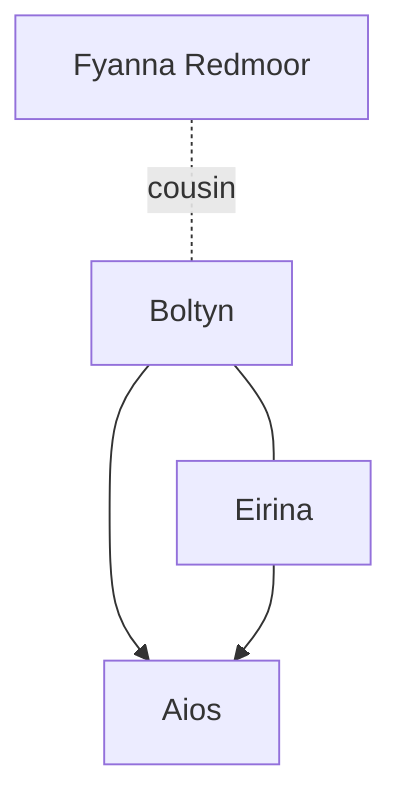

| Pair | Relation | Source |
| --- | --- | --- |
| Boltyn & Aios | Parent / child | [Sworn To Protect](../../main-story/monarch/sworn-to-protect.md) |
| Boltyn & Eirina | Spouses | [Boltyn About](../../heroes-of-rathe/boltyn-about.md) |
| Boltyn & Fyanna Redmoor | Cousins | [Boltyn About](../../heroes-of-rathe/boltyn-about.md) |
| Eirina & Aios | Parent / child | [Sworn To Protect](../../main-story/monarch/sworn-to-protect.md) |

### Bloodied Sands

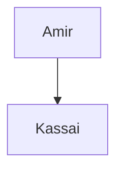

| Pair | Relation | Source |
| --- | --- | --- |
| Amir & Kassai | Parent / child | [Bloodied Sands](../../main-story/heavy-hitters/bloodied-sands.md) |

### The Spiders Trap

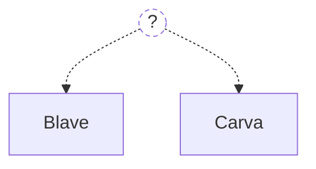

| Pair | Relation | Source |
| --- | --- | --- |
| Blave & Carva | Siblings | [The Spiders Trap](../../main-story/outsiders/the-spiders-trap.md) |

### Lyath About

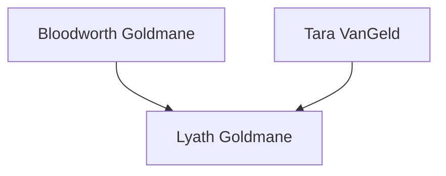

| Pair | Relation | Source |
| --- | --- | --- |
| Bloodworth Goldmane & Lyath Goldmane | Parent / child | [Lyath About](../../heroes-of-rathe/lyath-about.md) |
| Tara VanGeld & Lyath Goldmane | Parent / child | [Lyath About](../../heroes-of-rathe/lyath-about.md) |

### Trouble In Larinkmorth

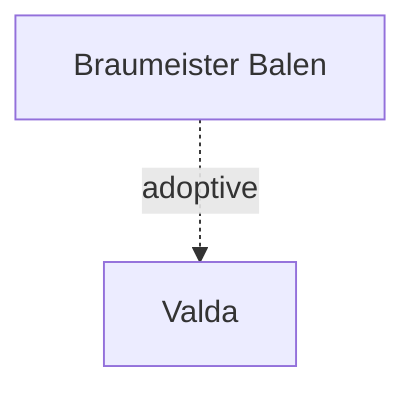

| Pair | Relation | Source |
| --- | --- | --- |
| Braumeister Balen & Valda | Parent / child (adoptive) | [Trouble In Larinkmorth](../../main-story/mastery-pack-guardian/trouble-in-larinkmorth.md) |

### No Pain No Gain

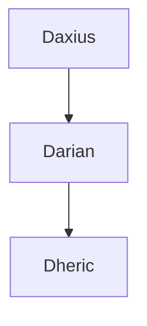

| Pair | Relation | Source |
| --- | --- | --- |
| Darian & Dheric | Parent / child | [No Pain No Gain](../../short-stories/dusk-till-dawn/no-pain-no-gain.md) |
| Daxius & Darian | Parent / child | [No Pain No Gain](../../short-stories/dusk-till-dawn/no-pain-no-gain.md) |
| Daxius & Dheric | Grandparent / grandchild | [No Pain No Gain](../../short-stories/dusk-till-dawn/no-pain-no-gain.md) |

### Dash

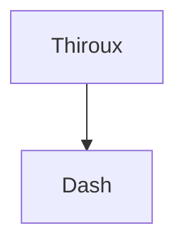

| Pair | Relation | Source |
| --- | --- | --- |
| Thiroux & Dash | Parent / child | [Dash](../../short-stories/roll-of-honour/dash.md) |

### Betrayal / Dragons Of Empire / Fires Of Rebellion

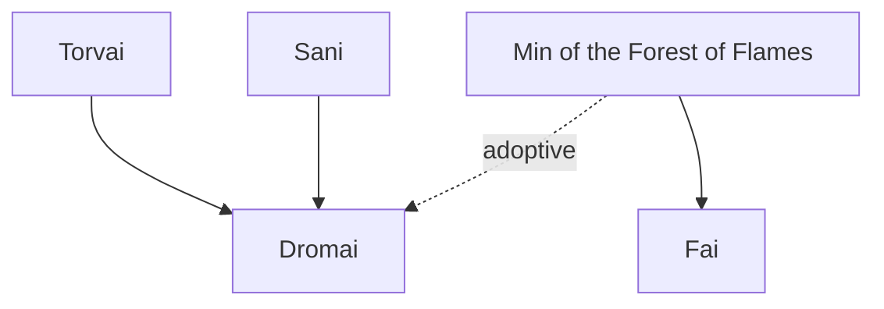

| Pair | Relation | Source |
| --- | --- | --- |
| Dromai & Fai | Siblings (adoptive) | [Dragons Of Empire](../../main-story/uprising/dragons-of-empire.md) |
| Min of the Forest of Flames & Dromai | Parent / child (adoptive) | [Betrayal](../../main-story/uprising/betrayal.md) |
| Min of the Forest of Flames & Fai | Parent / child | [Fires Of Rebellion](../../main-story/uprising/fires-of-rebellion.md) |
| Sani & Dromai | Parent / child | [Dragons Of Empire](../../main-story/uprising/dragons-of-empire.md) |
| Torvai & Dromai | Parent / child | [Dragons Of Empire](../../main-story/uprising/dragons-of-empire.md) |

### Trouble In Larinkmorth

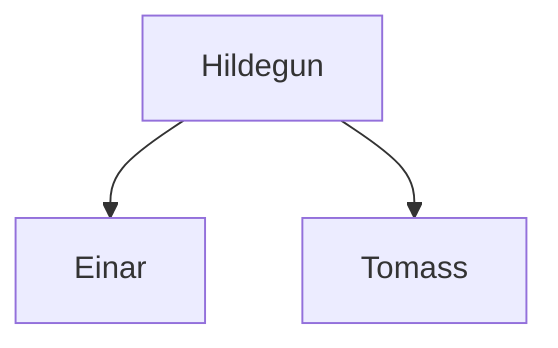

| Pair | Relation | Source |
| --- | --- | --- |
| Einar & Tomass | Siblings | [Trouble In Larinkmorth](../../main-story/mastery-pack-guardian/trouble-in-larinkmorth.md) |
| Hildegun & Einar | Parent / child | [Trouble In Larinkmorth](../../main-story/mastery-pack-guardian/trouble-in-larinkmorth.md) |
| Hildegun & Tomass | Parent / child | [Trouble In Larinkmorth](../../main-story/mastery-pack-guardian/trouble-in-larinkmorth.md) |

### From The Ashes

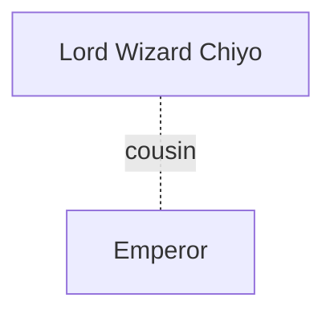

| Pair | Relation | Source |
| --- | --- | --- |
| Emperor & Lord Wizard Chiyo | Cousins | [From The Ashes](../../main-story/arcane-rising/from-the-ashes.md) |

### Part 4 The Hare And The Snake

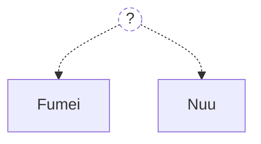

| Pair | Relation | Source |
| --- | --- | --- |
| Fumei & Nuu | Siblings (adoptive) | [Part 4 The Hare And The Snake](../../main-story/part-the-mistveil/part-4-the-hare-and-the-snake.md) |

### Its Just Business

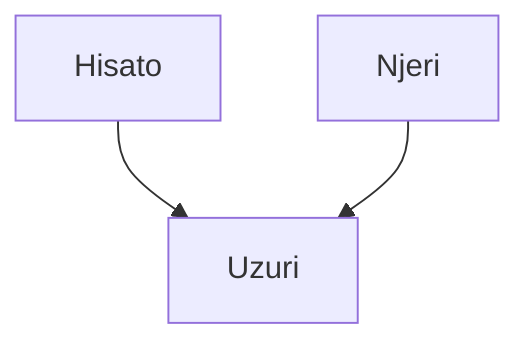

| Pair | Relation | Source |
| --- | --- | --- |
| Hisato & Uzuri | Parent / child | [Its Just Business](../../main-story/outsiders/its-just-business.md) |
| Njeri & Uzuri | Parent / child | [Its Just Business](../../main-story/outsiders/its-just-business.md) |

### Edge Of Autumn

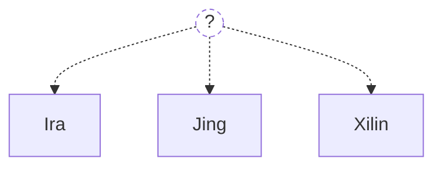

| Pair | Relation | Source |
| --- | --- | --- |
| Ira & Jing | Siblings | [Edge Of Autumn](../../main-story/crucible-of-war/edge-of-autumn.md) |
| Ira & Xilin | Siblings | [Edge Of Autumn](../../main-story/crucible-of-war/edge-of-autumn.md) |
| Jing & Xilin | Siblings | [Edge Of Autumn](../../main-story/crucible-of-war/edge-of-autumn.md) |

### Lady Barthimont

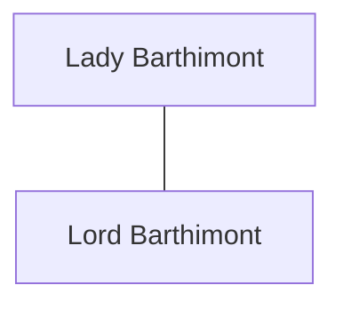

| Pair | Relation | Source |
| --- | --- | --- |
| Lady Barthimont & Lord Barthimont | Spouses | [Lady Barthimont](../../other-characters/lady-barthimont.md) |

### Minerva Themis

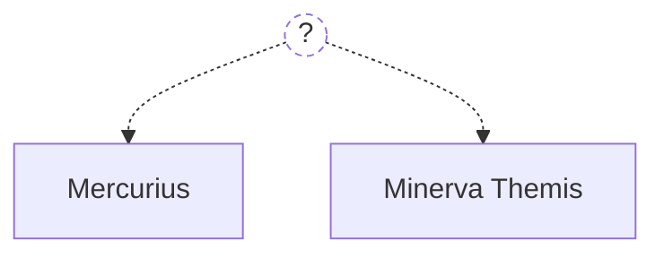

| Pair | Relation | Source |
| --- | --- | --- |
| Mercurius & Minerva Themis | Siblings | [Minerva Themis](../../other-characters/minerva-themis.md) |
